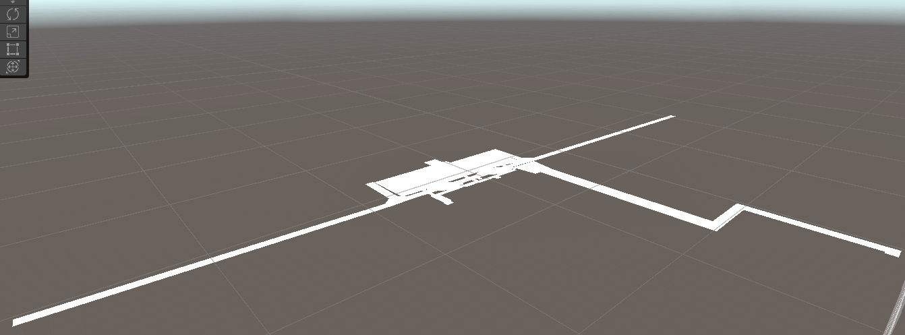
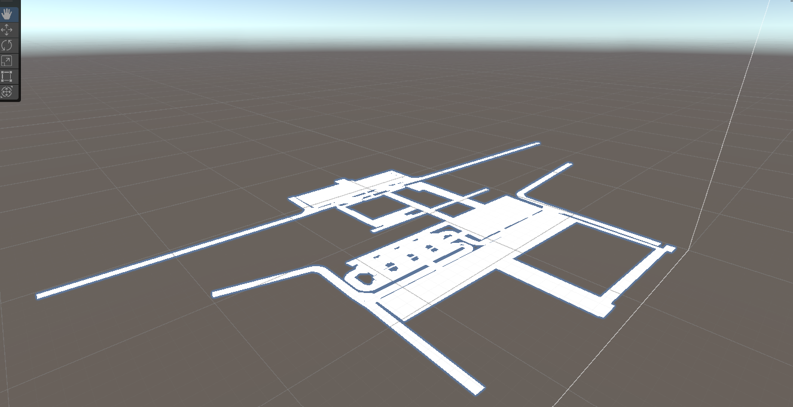
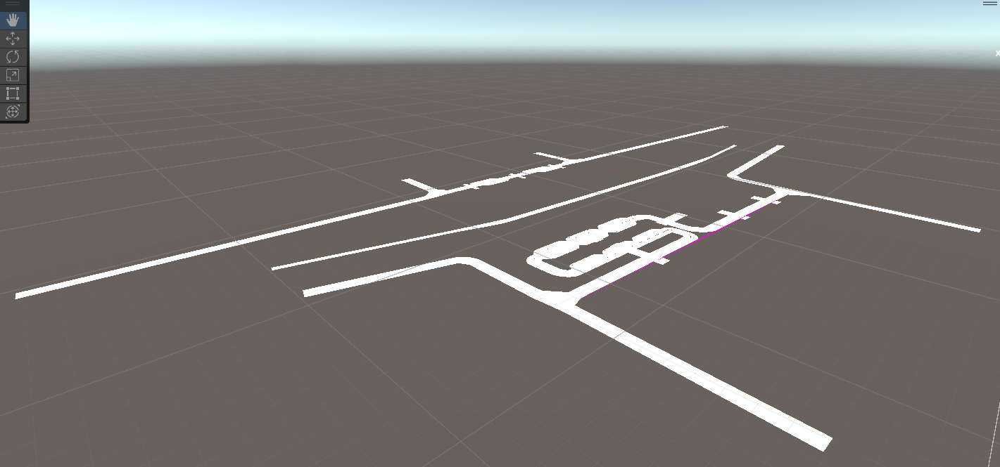
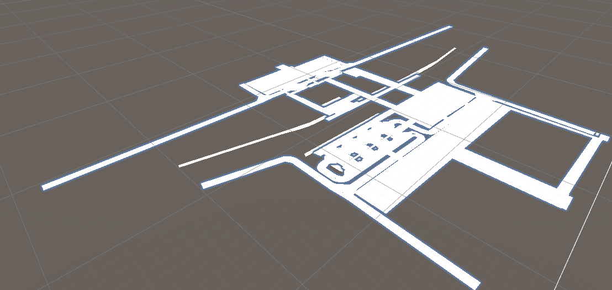
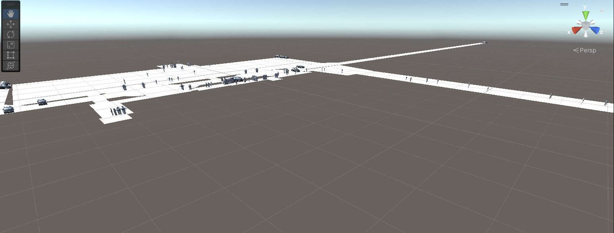
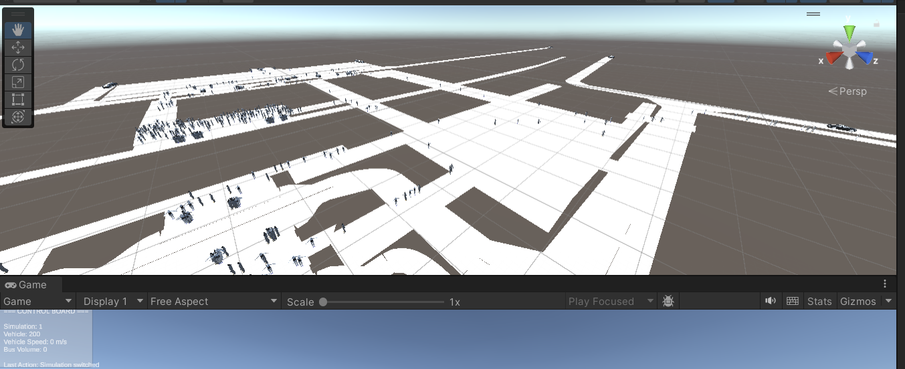
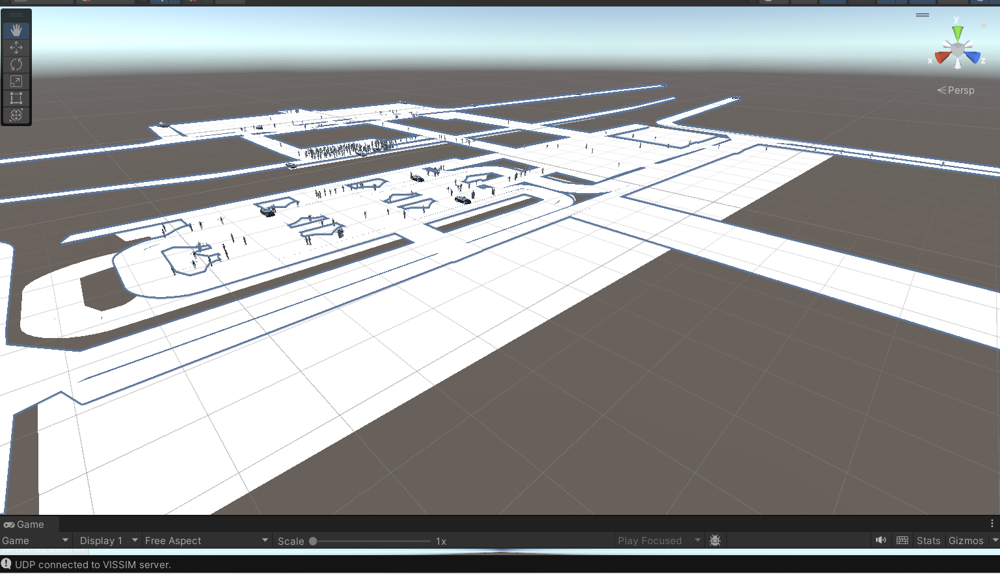

# Integration of PTV VISSIM with Unity

## Overview
This project presents a **bidirectional real-time co-simulation platform** integrating **PTV VISSIM** and **Unity**. The system combines:

- **PTV VISSIM** → microscopic traffic simulation  
- **Unity** → interactive 3D visualization  

The integration enables real-time interaction with traffic simulations. 
---

## Key Features
- Real-time bidirectional communication  
- Interactive simulation control (speed, volume, scenarios)  
- Visualization of vehicles and pedestrians  
- Multi-scenario support  
- Scalable architecture using middleware  

---

## System Architecture

### Components
- **Unity (Frontend)**
  - 3D visualization
  - User interaction
  - UDP communication

- **Python Middleware**
  - Acts as a bridge between Unity and VISSIM
  - Handles JSON-based messaging
  - Interfaces with VISSIM via COM

- **PTV VISSIM**
  - Traffic simulation engine
  - Provides real-time dynamic data

---

## Communication Workflow
1. Unity sends commands via UDP  
2. Python processes commands and interacts with VISSIM  
3. VISSIM runs simulation and outputs data  
4. Python sends updated state back to Unity  
5. Unity visualizes results in real time  

---

## Technologies Used
- PTV VISSIM  
- Unity (C#)  
- Python  
- COM Interface  
- User Datagram Protocol (UDP) Networking  
- JSON  

---

## Dependencies & Setup

To run the Python–VISSIM–Unity integration, the following dependencies are required.

---

### 1. Software Requirements

- **PTV VISSIM 2025** (installed with COM interface enabled)
- **Unity Hub + Unity Editor**
- **Python 3.8+**
- **Windows OS** ⚠️ (required for VISSIM COM interface)

---

### 2. Python Libraries

Install required Python packages:

pip install pywin32

## Methodology
- Static road network data exported from VISSIM and imported into Unity  
- Dynamic data (vehicle and pedestrian positions) transmitted in real time  
- UDP used for fast communication (low latency preferred over reliability)  
- Unity prefabs used for visualization  

---

## Controls (Unity)
- `1, 2, 3` → Switch scenarios  
- `↑ / ↓` → Adjust vehicle volume  
- `← / →` → Adjust vehicle speed  

---

## Results

---

### Static Models

  

<b>Figure 1:</b> Static model of scenario zero.

---

  

<b>Figure 2:</b> Static model of scenario one.

---

  

<b>Figure 3:</b> Static model of scenario three.

---

### Overlay of Scenarios

  

<b>Figure 4:</b> Overlay of the three static models.

---

### Dynamic Simulation (Real-Time Transmission)

  

<b>Figure 5:</b> Scenario zero simulation transmission of dynamic state data from VISSIM to Unity.

---

  

<b>Figure 6:</b> Scenario one simulation transmission of dynamic state data from VISSIM to Unity.

---

  

<b>Figure 7:</b> Scenario three simulation transmission of dynamic state data from VISSIM to Unity.

---

### Observations
- Accurate mapping of static models from VISSIM to Unity  
- Successful overlay of multiple scenarios  
- Real-time visualization of vehicle and pedestrian movement  
- Functional bidirectional interaction    

### Performance Note
Large UDP payloads may reduce performance.  
[Watch demo video](https://nextcloud.uni-weimar.de/s/CYzGHQLxnN3Ak5m)
**Password:** BeyondMap

---

## Limitations
- Single vehicle model used for all vehicle types  
- UDP may lead to packet loss  
- Performance depends on data size  

---

## Conclusion
This project demonstrates a **real-time interactive simulation platform** combining VISSIM and Unity. It enables dynamic control and visualization of traffic systems, supporting advanced transportation studies.

---

## Future Work
- Use distinct 3D models for different vehicle types  
- Optimize communication (hybrid UDP/TCP)  
- Improve scalability  
- Extend VR capabilities  

---

## References

- Shi, X., Yang, S., & Ye, Z. (2023). *Development of a Unity–VISSIM co-simulation platform to study interactive driving behavior*. Systems, 11(6), 269.  
- Erdagi, I. G., Gavric, S., & Stevanovic, A. (2025). *Development of multimodal physical and virtual traffic reality simulation system*. Applied Sciences, 15(9), 5115.  
- Istiqomah, N., & Qidun, M. B. S. (2018). *Traffic simulation in an intersection by using integrated VISSIM-MATLAB*. ICSEEA.  
- Wei, T., & Jarboe, P. (2010). *Integration of traffic simulation into design visualization: Case study*. Transportation Research Record, 2165(1), 89–95.  
- Artal-Villa, L., & Olaverri-Monreal, C. (2019). *Vehicle-pedestrian interaction in SUMO and Unity3D*. WorldCIST.  
- TurboSquid (n.d.). *Free 3D Car Unity Models*. Retrieved March 24, 2026, from https://www.turbosquid.com/3d-model/free/car/unity  

---

## Author
**Ozioma Henry Ehikwe, M.Sc**  
March 2026